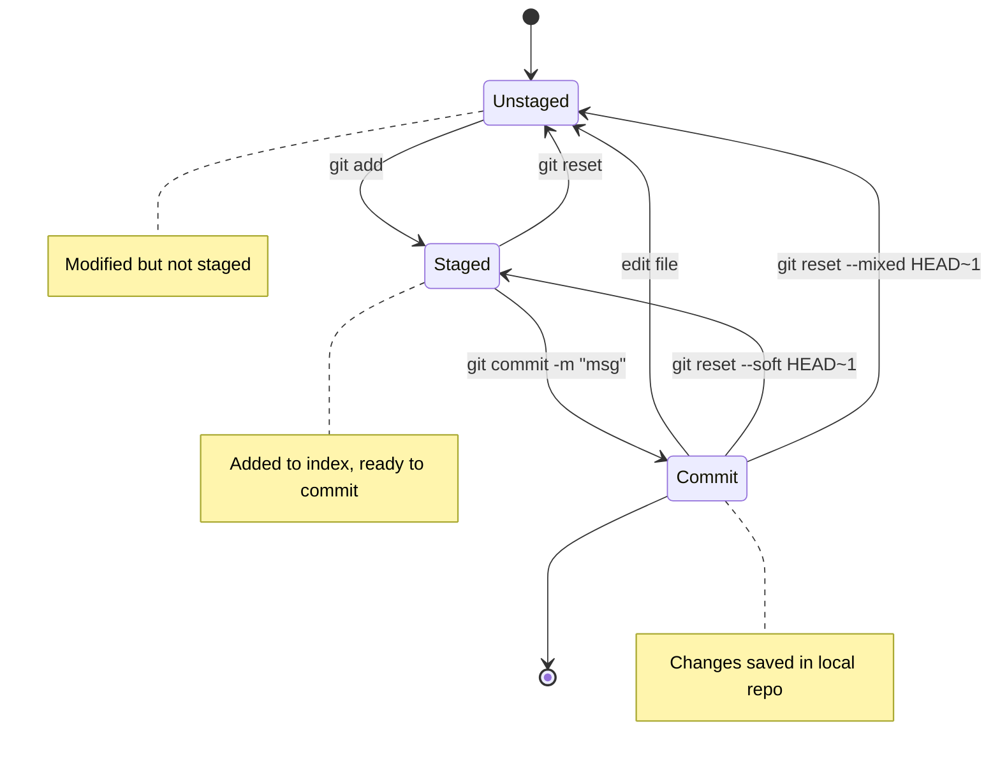

```mermaid
stateDiagram-v2
    [*] --> Unstaged

    Unstaged --> Staged : git add <file>
    Staged --> Commit : git commit -m "msg"

    Commit --> Unstaged : edit file
    Staged --> Unstaged : git reset <file>
    Commit --> Staged : git reset --soft HEAD~1
    Commit --> Unstaged : git reset --mixed HEAD~1
    Commit --> [*]

    note right of Unstaged : Modified but not staged
    note right of Staged : Added to index, ready to commit
    note right of Commit : Changes saved in local repo
```
