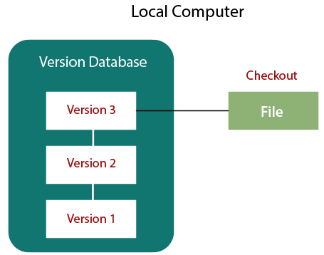
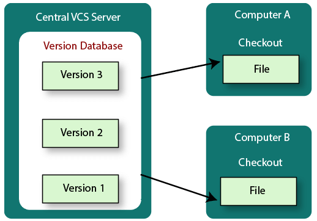
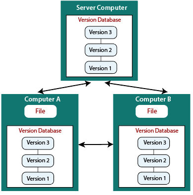

# GitPractice_2023_B2

<h3>What is Version Control ?</h3>
<ul>
  <li>A version control system is a software that tracks changes to a file or set of files over time so that you can recall specific versions later.</li>
  <li>The version control system is a collection of software tools that help a team to manage changes in a source code.</li>
  <li>It uses a special kind of database to keep track of every modification to the code.</li>
</ul>

<h3>Benefits of the Version Control System</h3>
<ol>
  <li>Complete change history of the file</li> 
  <li>Simultaneously working</li> 
  <li>Branching and merging</li> 
  <li>Traceability</li> 
 </ol>
 
 <h3>Types of Version Control System</h3>
 <ul>
  <li>Localized version Control System</li>
  <li>Centralized version control systems</li>
  <li>Distributed version control systems</li>
</ul>

<h3>Localized Version Control Systems</h3>
<ul>
  <li>The localized version control method is a common approach because of its simplicity. </li>
  <li>But this approach leads to a higher chance of error. In this approach, you may forget which directory you're in and accidentally write to the wrong file or copy over files you don't want to.</li>
  <li>The major drawback of Local VCS is that it has a single point of failure.</li>
</ul>

<h3>Centralized Version Control System</h3>
<li>These systems have a single server that contains the versioned files, and some clients to check out files from a central place.</li>
<h3>Centralized version control systems have many benefits, especially over local VCSs.</h3>
<li>Everyone on the system has information about the work what others are doing on the project.</li>
<li>Administrators have control over other developers.</li>
<li>It is easier to deal with a centralized version control system than a localized version control system.</li>
<li>A local version control system facilitates with a server software component which stores and manages the different versions of the files..</li>
</ul>
<h3>Drawback</h3>
<h4>Single point of failure.</h4>

<h3>Distrubuted Vesrion Control</h3>
<ul>
  <li>Every user has a local copy of a repository.</li>
  <li>So, the clients don't just check out the latest snapshot of the files even they can fully mirror the repository. </li>
  <li>The local repository contains all the files and metadata present in the main repository. </li>
 </ul>

<h3>Below tools are Distrubted vesion control systems</h3>
<ul>
  <li>Git</li>
  <li>Mercurial</li>
  <li>Bazaar or Darcs</li>
</ul>

  <a href="Git_installtion.md">Click here for Git Installtion details.</a>   
  
  <h4>Linux Commands</h4>
 <a href="basic_linux_commands.adoc/">Click here for basic Linux commands</a>
 
   <h4>Git Basics</h4>
 <a href="Git_notes.md/">Click here for git basic commands</a>

 
 

  
  

 
